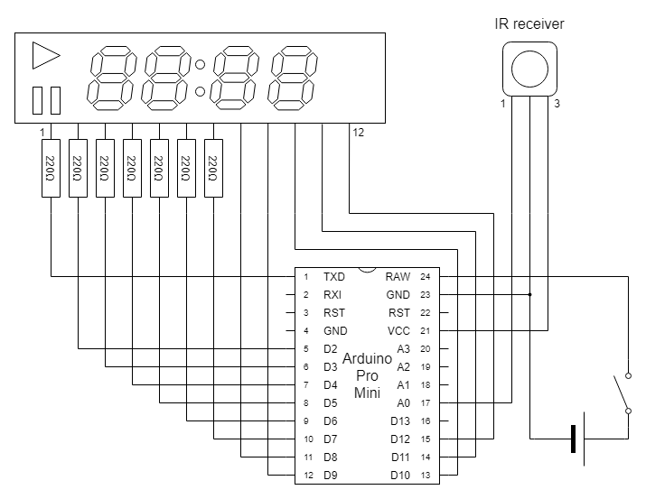

# Speakers Timer


## Use case


## Functions


* Enter the minutes and seconds by digit buttons.
* Counting down starts by START / PAUSE button.
* The timer is reset by RESET button on pausing or when counting down finished.
  * You can enter number if you press RESET button again.

## Hardware

### Parts

* [Arduino Pro Mini 3,3V 8MHz](https://www.switch-science.com/catalog/876/) (or compatible product)
* [4 digits, 7-segment display module](https://www.aitendo.com/product/5361)
* [IR receiver module](https://akizukidenshi.com/catalog/g/gI-04659/)
* [IR remote controller](https://www.aitendo.com/product/19084)
* 220&ohm; register &times; 7
* A switch
* A battery (3.3V)
* Wires, connectors, etc...

### Circuit



## Software 

### Build and transfer

Clone the source code and open the project file "SpeakersTimer.ino" with Arduino IDE.

This sketch depends on following libraries. (You can add these by library manager)

* [IRremote](https://github.com/Arduino-IRremote/Arduino-IRremote)

Almost certainly, the signal of each button is different according to the controller device.
You have to modify `codeTable` and other releated code in "SpeakersTimer.ino".

```
PROGMEM static const uint32_t codeTable[KEY_MAX] = {
    0x00FF9867, 0x00FFA25D, 0x00FF629D, 0x00FFE21D, 0x00FF22DD, // 0 ~ 4
    0x00FF02FD, 0x00FFC23D, 0x00FFE01F, 0x00FFA857, 0x00FF906F, // 5 ~ 9
    0x00FF6897, 0x00FFB04F,                                     // asterisk, pound
```

```
if (IrReceiver.results.decode_type == NEC && IrReceiver.results.bits == 32) {
```

You can build the source code with following configuration.

* Board: "Arduino Pro or Pro Mini"
* Processor: "ATmega328P (3.3V 8MHz)"

Then, you can transfer binary data to Arduino Pro Mini by any writer.

### License

These codes are licensed under [MIT License](LICENSE).
